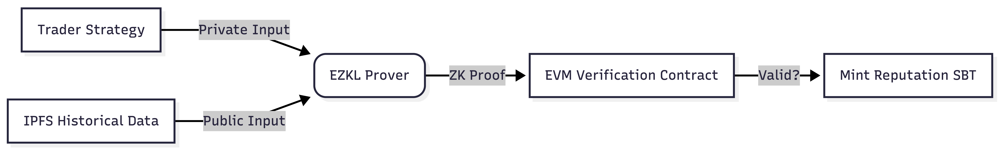

# Proof of Alpha

### A ZK-Powered Protocol for Verifiable DeFi Track Records

**Proof of Alpha** is a decentralized protocol that allows traders to cryptographically prove their historical performance without revealing their proprietary strategies. By leveraging Zero-Knowledge Machine Learning (ZKML) and deterministic scenario replay, we create an on-chain "Resume for DeFi" that is trustless, private, and portable.

---

## The Problem

In the current DeFi landscape, reputation is fragmented and unverifiable:
1.  **Traders cannot prove competence** to potential investors or funds without sharing their proprietary code or giving away their "Alpha."
2.  **Investors cannot verify track records** without risking capital or relying on easily forged screenshots.
3.  **Simulation games are toys** that lack the rigorous determinism required for professional verification.

## The Solution: Proof of Alpha

We decouple **strategy execution** from **strategy revelation**.

Users submit their trading logic (or ML model) to run against a cryptographically committed dataset of historical market conditions (the **Scenario Engine**). The protocol generates a Zero-Knowledge Proof (ZKP) certifying that:
> *"The holder of private key X ran Strategy Y on Data Z and achieved a 25% Return on Investment."*

The output is a **"Proof of Alpha" Soulbound Token (SBT)**—an on-chain badge of skill that grants access to:
* Uncollateralized lending pools.
* Signal marketplaces (selling calls without selling code).
* Exclusive DAO voting rights.

---

## Architecture

Our architecture prioritizes **determinism** over real-time simulation to ensure valid proofs.

1. The Scenario Engine (Data Layer)
Unlike traditional simulators that rely on live indexers (introducing latency and non-determinism), Proof of Alpha utilizes IPFS-hosted snapshots of historical blocks.

Determinism: Ensures that a strategy run today yields the exact same result as tomorrow, a requirement for ZK verification.

Tamper-Proof: Data commitments are stored on-chain, preventing "cherry-picked" market conditions.

2. The Proving Ground (ZKML Layer)
We utilize EZKL to convert trading logic (Python/ONNX models) into Halo2 circuits.

Privacy: The strategy logic remains client-side. Only the proof and the final balance are submitted on-chain.

Efficiency: Proofs are aggregated off-chain before submission to minimize gas costs.

3. The Settlement Layer (EVM Contracts)
A set of Solidity contracts on [Target Chain: Arbitrum/Base/Polygon]:

Verifier: Verifies the EZKL proof validity.

Registry: Maps user addresses to their verified P&L scores.

SBT Factory: Mints non-transferable tokens representing tiers of "Alpha" (e.g., Top 1% Trader 2024).

Technology Stack
ZKML Engine: EZKL (Halo2 circuits for inference verification).

Smart Contracts: Solidity (Hardhat/Foundry).

Data Availability: IPFS (Deterministic market snapshots).

Frontend: Next.js + Wagmi + RainbowKit.

Wallets: Coinbase Smart Wallet / Metamask.

Roadmap
Phase 1: The Proving Ground (Current)
[x] Conceptual Design & Pivot to Reputation Protocol.

[ ] Scenario Engine MVP: Replaying Uniswap V3 historical data from IPFS.

[ ] POC Verifier: A simple Solidity contract verifying a "Profitable Trade" proof via EZKL.

Phase 2: The Alpha League (Testnet)
[ ] Leaderboard dApp: Launch on Arbitrum Sepolia / Base Sepolia.

[ ] SBT Minting: Automating the issuance of reputation badges.

[ ] Farcaster Integration: "Bet on Bot" frames for community engagement.

Phase 3: The Signal Marketplace (Mainnet)
[ ] Mainnet Launch: Production deployment.

[ ] Copy-Trading Vaults: Allow users to deposit funds into vaults governed by "Proven" strategies (without revealing the strategy).

Contributing
Proof of Alpha is open-source. We welcome contributions, especially in:

Circuits: Optimizing EZKL constraints for financial logic.

Data Engineering: Cleaning and formatting historical DeFi data for IPFS storage.

Solidity: Optimizing gas costs for proof verification.

See CONTRIBUTING.md for details on how to set up the development environment.

License
Distributed under the MIT License. See LICENSE for more information.